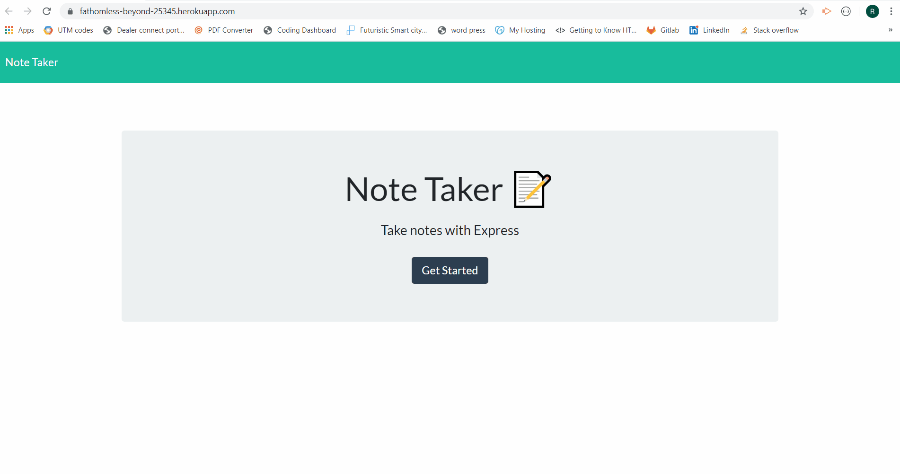

 

# ReadME generator

## <h2 id="#description">Project Description</h2>
Full-Stack application that allows a user to create, read, and delete notes. Application uses express and heroku for deployment.

## Table of Contents

* <a href="#license">License</a>
* <a href="#description">Description</a>
* <a href="#installation">Installation</a>
* <a href="#technology">Technologies Used</a>
* <a href="#contributors">Contributors</a>
* <a href="#contact">Contact</a>

## <h2 id="installation">Installation</h2>
Users can use the application by going to:  https://fathomless-beyond-25345.herokuapp.com/ or by cloning the repo and running it on a local machine. To run the application locally: Clone the repo from GitHUB, once cloned open up the terminal and type in "node server.js" to start the server, after the server is running type "localhost:5000" in to the browser of your choice to pull up the application.

## <h2 id="example">Application Example</h2>

    
## <h2 id="technology">Technologies Used</h2>
ES6,Node.JS,GitHUB,Heroku,UTIL,UUID

## <h2 id="contributors">Contributors</h2>
[rwilliamsIII](rwilliamsIII)

## <h2 id="contact">Contact</h2>

* #### Name: Robert Williams
* #### GitHUB: https://github.com/rwilliamsIII
* #### Portfolio: [https://rwilliamsiii.github.io/Portfolio/](https://rwilliamsiii.github.io/Portfolio/)
* #### Email: robert@a3marketing.com
* #### LinkedIN: [https://www.linkedin.com/in/robertwilliams2715/](https://www.linkedin.com/in/robertwilliams2715/)
